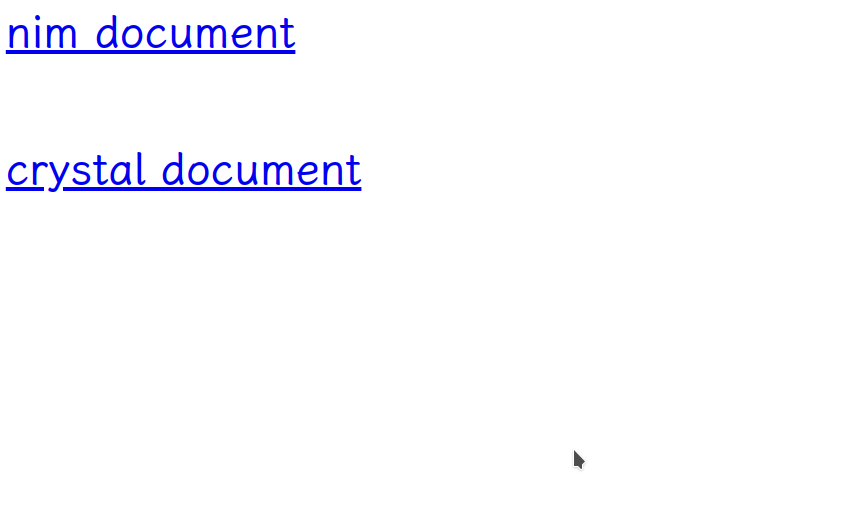
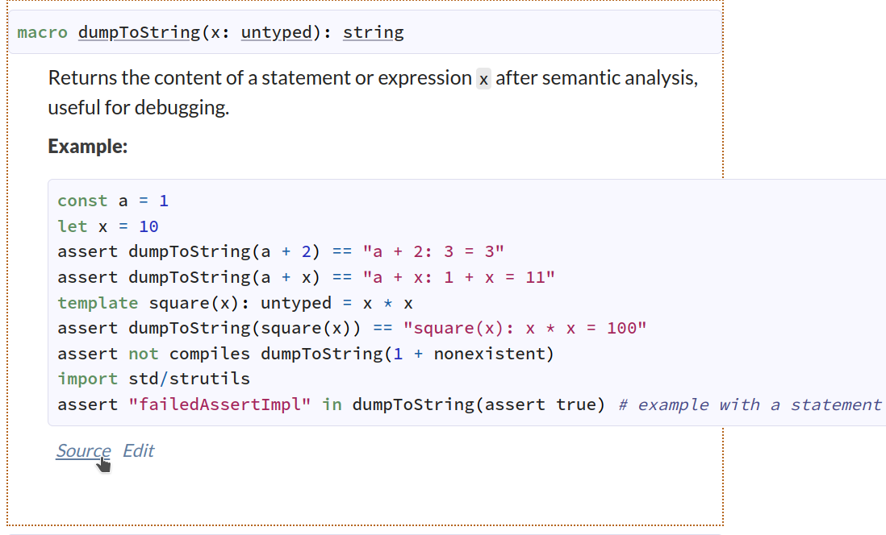
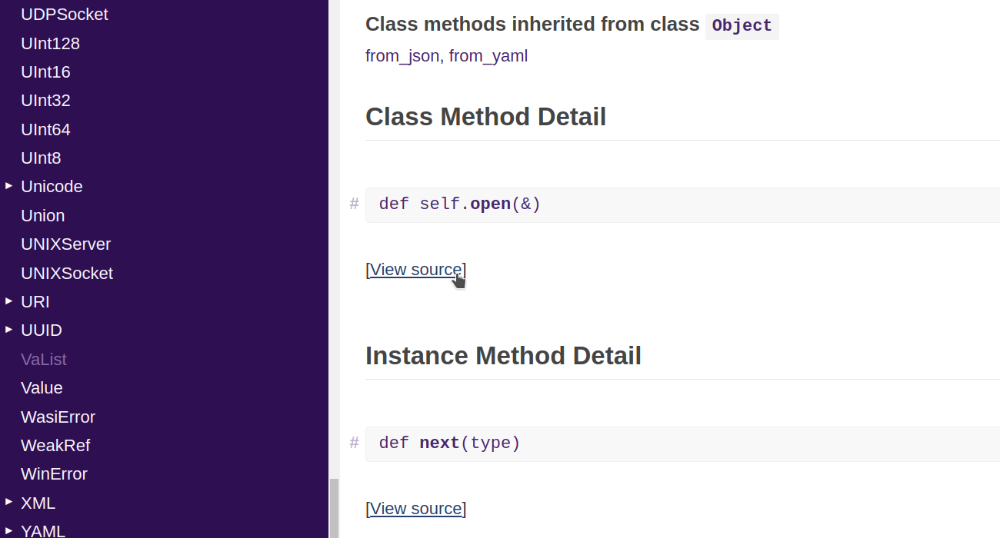
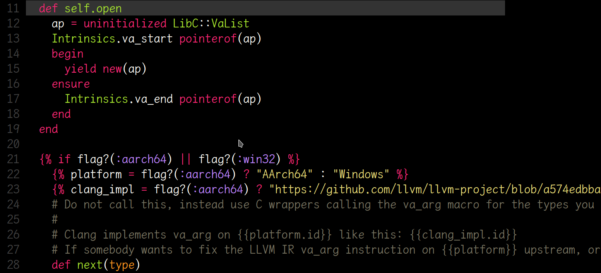

# Local document server

Sometimes, reading your favorite language's documents and source code in Github can be slow and inconvenient. With this program, you can do these things locally, making your life much easier. :)

Currently, it supports [nim](https://nim-lang.org/) and [crystal](https://crystal-lang.org/).

Some screenshots:









## Installation

```shell
git clone https://github.com/Athlon64/document_server
cd document_server
shards install && shards build --release
bin/docs
```

Then open `http://localhost:3000` in your browser.

## Usage

Modifying `env.yaml` to suit your needs.

## Contributing

1. Fork it (<https://github.com/your-github-user/docs/fork>)
2. Create your feature branch (`git checkout -b my-new-feature`)
3. Commit your changes (`git commit -am 'Add some feature'`)
4. Push to the branch (`git push origin my-new-feature`)
5. Create a new Pull Request

## Contributors

- [Alexander Zhou](https://github.com/Athlon64) - creator and maintainer
